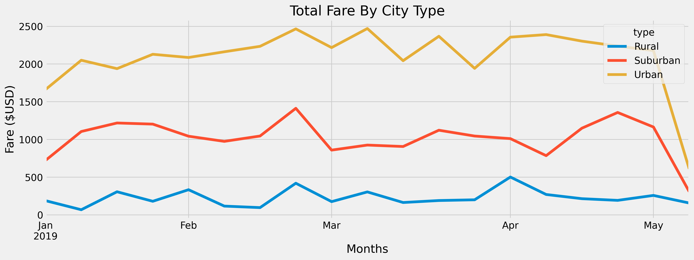

# Module 5 | Assignment - PyBer

Analyze and visualize ride-sharing data using Python, Pandas, and the Matplotlib library.

## Overview of the analysis:

- For this project, I used jupyter notebook to analyze the ridesharing data for city and fare per ride. Using the matplotlib to visualize the data to understand teh average fare as well as fare by city.

##The purpose of the new analysis is well defined. 

Results:

Below graph shows summary of data across citytype

The data analysis provides below details:

- Total Rides
Rural        125
Suburban     625
Urban       1625

- Total drivers

Rural         78
Suburban     490
Urban       2405

- Total fares

Rural        4327.93
Suburban    19356.33
Urban       39854.38

- Average fare per ride and driver
Rural       55.486282
Suburban    39.502714
Urban       16.571468

- Total fare by city type

##Summary:

The data analysis is useful to understand which cirty has highest number of ride and average fare. Also, it provides clear view of differences across rural, urban and suburban area in terms of fare and number of rides
